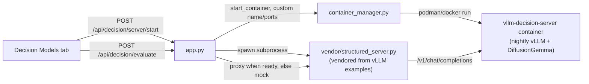

# Decision Models Guide (Experimental)

The **Decision Models** tab is a sandbox for exploring vLLM's native
*structured-read* decision capability: seeding a diffusion model's answer
canvas with a fixed template and reading calibrated per-slot probabilities
from a single denoise step, instead of generating free text token-by-token.

This feature is **experimental** and kept fully isolated from the main
Server Config / Instances flow on purpose -- it manages its own dedicated
container, its own ports, and its own Launch/Stop lifecycle, so it can never
interfere with (or be confused with) the vLLM instance you're actually
serving chat traffic from.

## Background

- vLLM PR [#57250](https://github.com/vllm-project/vllm/pull/57250) added
  structured-read support for discrete diffusion models.
- [`docs.vllm.ai/en/latest/examples/features/structured_diffusion`](https://docs.vllm.ai/en/latest/examples/features/structured_diffusion/)
  documents the `vllm_xargs` fields involved
  (`diffusion_seed_canvas`, `diffusion_pinned`, `diffusion_max_steps`,
  `diffusion_read_only`, `diffusion_constrained`) and ships an example
  reference server, `structured_server.py`, which this tab vendors (see
  [Architecture](#architecture) below).
- Red Hat's [DiffusionGemma article](https://developers.redhat.com/articles/2026/09/28/run-decision-model-vllm-and-red-hat-ai)
  covers running `google/diffusiongemma-26B-A4B-it` (a block-diffusion Gemma
  4 MoE model, 26B total / 4B active params) on vLLM nightly builds, including
  FP8-dynamic and NVFP4 quantized variants.

**This tab deliberately only talks to a vLLM instance you launch yourself.**
It has no dependency on the public `vllm-sr.ai` / Decision Studio demo
endpoint -- everything here runs against your own hardware.

## Hardware & software requirements

| Requirement | Why |
|---|---|
| **NVIDIA GPU** | DiffusionGemma's attention backend needs FlashAttention4 (or Triton as a fallback). FlashInfer is explicitly rejected by vLLM for this model, and AMD/ROCm is not currently supported. |
| **A nightly vLLM build** | Structured-read support isn't in a stable vLLM release yet. The tab defaults to a known-good `nightly-<sha>` tag from the Red Hat guide (see [Settings](#settings--defaults)), but nightly tags drift fast -- check [vllm/vllm-openai tags on Docker Hub](https://hub.docker.com/r/vllm/vllm-openai/tags) if a launch fails to pull or start. |
| **`transformers` Python package** | Required by the vendored sidecar to resolve answer-template token slots. Install with `pip install 'vllm-playground[decision-models]'`. Not installed by default since the whole tab is optional. |
| **Container runtime (podman/docker)** | The Decision Server always launches via Container mode, regardless of which run mode your main vLLM Server tab is using. |

The tab checks GPU availability via the same `/api/hardware-capabilities`
endpoint used elsewhere in the playground, and disables the **Launch
Decision Server** button with an explanatory message if no compatible NVIDIA
GPU is detected -- so a doomed launch fails fast instead of timing out
minutes later mid-pull.

## Architecture

- **`vllm_playground/decision_models.py`** owns all Decision Server state
  (phase, logs, model/image/canvas config) in a process-local object --
  completely separate from `app.py`'s global `vllm_process`/`current_config`
  used by the main Server Config flow, and **not** registered in
  `backend_registry.py` / the Instances page. Stopping or restarting your
  main vLLM server never touches the Decision Server, and vice versa.
- The dedicated container is always named `vllm-decision-server` and bound
  to its own fixed ports (`8800` for vLLM, `8801` for the sidecar), so it
  can coexist with any other instance you're running.
- **`vllm_playground/vendor/structured_server.py`** is vendored unmodified
  (apart from swapping `pybase64` for the stdlib `base64` module) from
  vLLM's own example at
  `examples/features/structured_diffusion/structured_server.py`. It exposes
  `POST /v1/systemone` (the "Jev" decision API this tab speaks),
  `POST /v1/chat/completions`, and `POST /v1/raw/chat/completions`. vLLM
  explicitly documents this script as example/reference code, **not a
  stable API** -- expect its request/response shape to evolve across vLLM
  releases, and expect to need to re-vendor it occasionally.
- `POST /api/decision/evaluate` always returns a response tagged
  `"source": "live"` or `"source": "mock"`. When the Decision Server isn't
  running (or a live call fails for any reason), it transparently falls
  back to a deterministic mock evaluator so the gallery and both
  interactive demos stay usable without a GPU -- never a silent fake
  result presented as real.

## Using the tab

1. Open the **Decision Models** nav item (under *Experimental*, marked
   `BETA`).
2. If you want live results, expand **Launch settings** to review/adjust
   the model, nightly image tag, canvas length, and optional GPU device,
   then click **Launch Decision Server**. Status moves through
   `pulling -> starting vLLM -> waiting for health check -> starting sidecar -> ready`,
   with live logs available under **Server logs**. This step can take
   several minutes (pulling a 26B-parameter nightly image, then model
   load) -- it's normal for `waiting for health check` to sit for a while.
3. Without launching anything, every use case in the **Use Cases** gallery
   already works against the mock evaluator, clearly marked with a
   `SIMULATED` badge.
4. Click any card to open its run panel:
   - **Most cards** show an editable `state` field and an "Advanced: edit
     questions JSON" panel, plus a **Run Decision** button.
   - **Race Lane Decider** and **Rubric Grading Puzzle** (see below) have
     their own bespoke interactive UI instead of the generic JSON editor.
5. Click **Stop** at any time to tear down the sidecar and container; this
   never affects your main vLLM Server instance.

### Use case catalog

| Use case | Question type(s) | What it demonstrates |
|---|---|---|
| Support Ticket Routing | Choice | The canonical "choose 1 of N labeled options" decision. |
| Billing Dispute Gate | Noul | A yes/no gate with a calibrated probability, suitable for thresholding into auto-approve/escalate. |
| Urgency Scoring | Score | An ordered severity scale -- the response is an expected value, not just an argmax. |
| Chained Multi-Question Triage | Choice -> conditional Noul | `structured_server.py`'s `depends_on` / `ask_if` extensions for multi-stage reads. |
| Agent Tool Selection | Choice (dynamic candidates) | A decision model as a cheap pre-router in front of full agentic tool-calling. |
| **Race Lane Decider** | Choice + Noul (interactive) | A live control loop: every tick, the game compresses lane obstacles into state and asks for the safest lane plus a hazard probability in one batched call. |
| **Rubric Grading Puzzle** | N x Score (interactive) | An entire rubric graded in one request: the submission and rubric are shared state, and each criterion is one Score question. |

### Race Lane Decider

A small lane-dodging game rendered directly in the tab. Every tick:

1. The upcoming track layout (nearest-obstacle distance per lane) is
   compressed into `state`, e.g. `{"current_lane": "center", "left": "clear", "center": "clear", "right": "obstacle_row_2"}`.
2. One batched request asks for a `lane` (Choice: `left`/`center`/`right`)
   and a `hazard` (Noul: collision probability) in a single call.
3. The car moves to the decided lane; a collision ends the run and shows
   how many rows were survived.

Use **Speed** to slow the loop down while watching the hazard probability
and decision latency readouts, and the `SIMULATED`/`LIVE` badge to confirm
which evaluator answered. With the mock evaluator, lane choices are
randomized per content hash rather than reasoning about geometry, so
crashes are expected and not a bug -- launch the real Decision Server to
see geometry-aware lane choices.

### Rubric Grading Puzzle

Edit the submission text and rubric instructions, then click **Grade
Submission**. The whole rubric (however many criteria the use case defines)
is sent as a *single* request: the submission/rubric go once as shared
`state`, and each criterion is its own `score` question -- demonstrating
`structured_server.py`'s batching rather than one round trip per criterion.

## Settings & defaults

Settings persist to `~/.vllm-playground/settings.json` under:

| Key | Default | Notes |
|---|---|---|
| `decision_image_tag` | *(empty -> built-in nightly default)* | Validated the same way as the main Container Images settings (safe characters for a Docker image reference). |
| `decision_canvas_length` | `64` | Must be a multiple of 16 between 16 and 512; must be long enough to hold the longest answer template you intend to run. |
| `decision_model_override` | *(empty -> `google/diffusiongemma-26B-A4B-it`)* | Point at an FP8-dynamic/NVFP4 quantized variant (e.g. from Red Hat's Hugging Face collection) if your GPU needs the smaller footprint. |

Per-launch overrides entered in the **Launch settings** panel always take
precedence over saved settings for that one launch.

## Troubleshooting

- **Launch button disabled / hardware warning shown** -- no compatible
  NVIDIA GPU was detected. AMD/ROCm and CPU-only setups aren't supported by
  DiffusionGemma today.
- **Pull or start fails** -- the pinned nightly tag has likely rotated off
  Docker Hub. Grab a current `nightly-<sha>` from
  [vllm/vllm-openai tags](https://hub.docker.com/r/vllm/vllm-openai/tags)
  and paste it into the Image Tag field (or the `decision_image_tag`
  setting).
- **Stuck on "waiting for health check"** -- expected for the first launch
  of a large model; check **Server logs** for actual progress. If the
  container exited, `get_container_status`-style issues (OOM, missing GPU
  passthrough) will show there.
- **Sidecar fails to start with an import error** -- install the optional
  extra: `pip install 'vllm-playground[decision-models]'` (installs
  `transformers`, used only by the vendored sidecar).
- **Results always say `"source": "mock"` even after Launch succeeds** --
  check `GET /api/decision/status` (or the status panel) for `phase`;
  evaluate only proxies live once `phase` is `ready`. A live call that
  errors (e.g. sidecar crashed) also silently falls back to mock with the
  error folded into the response's `note` field -- check **Server logs**.

## Stability note

The request/response contract used here (`/v1/systemone`, the Jev-shaped
`noul`/`choice`/`score` answers, and the vendored `structured_server.py`
itself) is explicitly documented upstream as **example code, not a stable
vLLM API**. Expect it to change across vLLM releases, and treat this whole
tab as a prototype for exploring the capability -- not a production
integration surface.
