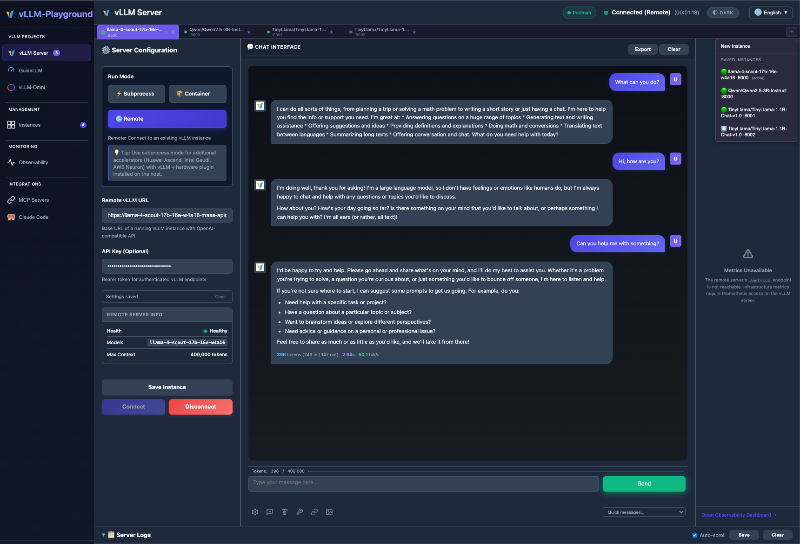
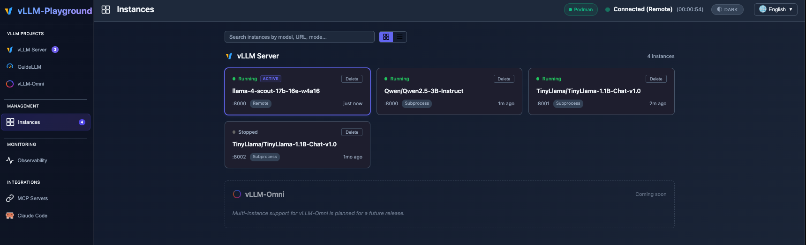

# Multi-Instance Guide

vLLM Playground lets you run and manage multiple vLLM servers side by side.
Each server — whether a local subprocess, a container, or a remote endpoint —
lives in its own **Instance** with isolated chat history, logs, token tracking,
and performance metrics. Switch between them with a single click.

### UI overview

**vLLM Server** view with multiple instance tabs, per-instance configuration, chat, and the saved-instances list:



**Management → Instances** lists every saved backend in a searchable grid (run mode, port, and running / stopped status):



---

## Table of Contents

1. [What is an Instance?](#what-is-an-instance)
2. [Quick Start (First-Time User)](#quick-start-first-time-user)
3. [Creating a New Instance](#creating-a-new-instance)
4. [Switching Between Instances](#switching-between-instances)
5. [Saving Instances](#saving-instances)
6. [Stopping and Restarting](#stopping-and-restarting)
7. [Removing Instances](#removing-instances)
8. [Returning to Saved Instances](#returning-to-saved-instances)
9. [Scenario Reference](#scenario-reference)
10. [Instance Status Reference](#instance-status-reference)
11. [Tips and Notes](#tips-and-notes)

---

## What is an Instance?

An **Instance** is created when a vLLM server is successfully started (or
connected to). It bundles together:

| Component | Description |
|-----------|-------------|
| **Server** | The running vLLM process, container, or remote endpoint |
| **Configuration** | Model name, port, GPU settings, advanced flags |
| **Chat History** | The conversation you have with that model |
| **Server Logs** | Output from the vLLM server process |
| **Token Counter** | Tracks conversation length vs. model context window |
| **Performance Metrics** | Throughput, latency, and other vLLM metrics |

Instances appear as **tabs** at the top of the UI. The active tab determines
which server you are chatting with and which logs, metrics, and config you see.

> **Key concept:** Editing configuration fields alone does *not* create an
> Instance. An Instance only appears once the server has successfully started
> or connected.

---

## Quick Start (First-Time User)

If this is your first time opening vLLM Playground, there are no instances yet.
Follow these steps to get one running:

### 1. Open the Playground

```bash
python3 run.py
```

Navigate to **http://localhost:7860** in your browser.

### 2. Choose a Run Mode

In the **Configuration** panel on the left, pick one of the three run modes:

| Run Mode | What it does |
|----------|-------------|
| **Subprocess** | Launches vLLM as a local Python process (requires vLLM installed) |
| **Container** | Runs vLLM inside a Docker / Podman container |
| **Remote** | Connects to an already-running vLLM server at a URL you provide |

### 3. Configure and Start

- **Subprocess / Container:** Select a model, adjust GPU and advanced settings
  as needed, then click **Start Server**.
- **Remote:** Enter the server URL (e.g. `http://192.168.1.50:8000`) and
  optional API key, then click **Connect**.

### 4. Start Chatting

Once the status indicator turns green, type a message in the chat panel and
press Enter. You now have your first Instance.

---

## Creating a New Instance

You can run multiple vLLM servers at the same time, each on its own port.

### Step by step

1. Click the **+** button in the tab bar.
2. Select **New Instance** from the dropdown.
3. A **draft tab** appears with a dashed border labeled "New Instance." The
   port field is automatically set to the next available port.
4. Configure the server in the left panel. The config panel briefly highlights
   to draw your attention.
5. Click **Start Server** (or **Connect** for remote mode).
6. On success the draft tab becomes a real instance tab with a green status dot
   and the model name as its label.

### What the draft tab looks like

While in draft mode, the chat area shows a placeholder:

> **New Instance**
> Configure the server settings in the left panel, then click **Start Server**
> to begin.

If you click a different tab before starting the server, the draft is
discarded — no instance is created.

### Automatic port allocation

When you create a new instance, the playground picks the next free port in the
range **8000 – 8100**. You can change it manually before starting, but the
backend will reassign if your chosen port is already in use.

---

## Switching Between Instances

Click any tab in the tab bar to switch. Everything updates instantly:

| Panel | What happens on switch |
|-------|----------------------|
| **Chat** | Previous instance's conversation is stored; the new instance's chat history is restored |
| **Server Logs** | Log viewer clears and shows logs specific to the selected instance |
| **Configuration** | Form fields populate with the instance's saved config |
| **Token Counter** | Conversation token count and max context window update to match the instance |
| **Performance Metrics** | Metrics refresh for running instances; cleared for stopped ones |
| **Buttons** | Labels change between Start Server / Stop Server and Connect / Disconnect depending on run mode |

Chat history and token counts are kept in memory so subsequent switches are
instant — no network round-trip needed.

---

## Saving Instances

By default, instances exist only in memory. If you stop the playground, unsaved
instances are lost. To make an instance survive restarts, **save** it.

### How to save

Either:

- Click **Save Instance** in the configuration panel, or
- Right-click the instance's tab and choose **Save Instance**.

A saved instance shows a **star** on its tab.

### Where data is stored

| Data | Location |
|------|----------|
| Instance config & metadata | `~/.vllm-playground/instances.json` |
| Chat history | Browser `localStorage` (keyed per instance) |

### What "saved" means

- The instance's **configuration, port, run mode, and model** are written to
  disk.
- On next startup, saved instances are loaded back into the tab bar (initially
  in a stopped state — see [Returning to Saved Instances](#returning-to-saved-instances)).
- Chat history remains in your browser's `localStorage` and is restored when
  you switch to that tab, regardless of whether the instance is saved.

---

## Stopping and Restarting

### Stopping

1. Switch to the instance's tab.
2. Click **Stop Server** (or **Disconnect** for remote).
3. The tab remains with a gray status dot. The server process or container is
   terminated (remote instances simply disconnect).
4. Chat history is preserved — you can scroll through previous messages.

### Restarting a stopped instance

1. Switch to the stopped instance's tab.
2. Click **Start Server** (or **Connect**).
3. The server starts with the same configuration. On success the status dot
   turns green again.

> Stopping does not remove the tab. The instance stays available until you
> explicitly remove it.

---

## Removing Instances

### From the tab bar

- Click the **x** button on a tab, or
- Right-click the tab and choose **Remove Instance**.

A confirmation dialog appears:

> **Remove Instance**
> Stop and remove "model-name (:port)"? This will terminate the server and
> delete its chat history.

Clicking **Remove** will:

- Stop the server if it is still running.
- Delete the instance from the tab bar and from `instances.json` (if saved).
- Clear its chat history from memory and `localStorage`.
- Clear its log buffer.

If there are other instances, the playground switches to one of them. If this
was the last instance, the tab bar shows "No instances."

> The **x** button is hidden when only one tab remains, so you always have at
> least one tab visible.

---

## Returning to Saved Instances

When you restart the playground, every saved instance is loaded back.

### What happens on startup

| Run Mode | Recovery behavior |
|----------|------------------|
| **Subprocess** | Playground checks if the original process (PID) is still running and the port is responding. If yes, the instance resumes as healthy. If not, it is marked **stopped**. |
| **Container** | Playground checks if the Docker/Podman container is still running. If yes, it resumes as healthy. If not, it is marked **stopped**. |
| **Remote** | Always marked **stopped** (disconnected). You must click **Connect** to reconnect. |

### Accessing saved instances

There are two ways:

1. **Tab bar** — Saved instances appear as tabs automatically on startup.
2. **+ dropdown** — Click **+** in the tab bar. Under the "Saved Instances"
   section, each saved instance is listed with a status indicator and its
   model/port. Click one to switch to it.

---

## Scenario Reference

| Scenario | What happens |
|----------|-------------|
| **First launch, no saved instances** | Tab bar shows "No instances." Click **+** → **New Instance** to get started, or configure directly in the left panel and start a server. |
| **First launch, with saved instances** | Saved instances load into the tab bar. Subprocess/container instances are checked for liveness. Remote instances start as disconnected. The previously active instance is selected. |
| **Start a subprocess instance** | Select Subprocess mode, pick a model, click **Start Server**. vLLM launches as a child process. A new tab appears with a green dot once healthy. |
| **Start a container instance** | Select Container mode, pick a model, click **Start Server**. A Docker/Podman container is created. Tab appears once the container is ready (up to 3 min timeout). |
| **Connect to a remote instance** | Select Remote mode, enter the URL, click **Connect**. Playground probes health and discovers available models. Tab appears on success. |
| **Switch between running instances** | Click the target tab. Chat, logs, config, metrics, and token counter all update to the selected instance. |
| **Switch to a stopped instance** | Click the tab. Chat history is restored (read-only until restarted). Logs show last buffered output. Metrics panel is cleared. Config is populated so you can restart. |
| **Save an instance** | Click **Save Instance** or right-click tab → **Save Instance**. A star appears on the tab. Instance is written to `~/.vllm-playground/instances.json`. |
| **Stop a running instance** | Click **Stop Server** / **Disconnect**. Tab turns gray. Process or container is terminated. Instance remains in the tab bar. |
| **Remove a running instance** | Click **x** or right-click → **Remove Instance**. Server is stopped and the instance is deleted entirely. |
| **Remove a stopped instance** | Same as above, but no server to stop. Instance is deleted from tab bar, disk, and localStorage. |
| **Restart playground with saved instances** | Saved instances reload. Processes/containers are re-checked. Remote instances require manual reconnection. Unsaved instances from the previous session are gone. |
| **Port conflict** | If the port you chose is already in use, the backend automatically allocates the next free port in the 8000–8100 range. |

---

## Instance Status Reference

Each tab has a small colored dot indicating the instance's current state:

| Status | Dot | Meaning |
|--------|-----|---------|
| **Healthy** | Green | Server is running and responding to health checks |
| **Starting** | Yellow (pulsing) | Server is launching and not yet ready |
| **Unhealthy** | Red | Server is running but health checks are failing |
| **Unreachable** | Red | Remote server cannot be contacted |
| **Stopped** | Gray | Server is not running (subprocess terminated, container stopped, or remote disconnected) |
| **Draft** | Dashed outline | New instance being configured, not yet started |

Health checks run every 15 seconds in the background for all running instances.

---

## Tips and Notes

- **Simultaneous instances:** You can have multiple vLLM servers running at
  once — each on a different port. This is useful for A/B testing models or
  running different configurations side by side.

- **One active tab at a time:** Only the selected tab's chat, logs, and metrics
  are visible. Background instances keep running — you just aren't viewing them.

- **Port range:** Automatic allocation uses ports **8000 – 8100**. You can
  manually choose any port in this range, or outside it if you prefer.

- **Chat history location:** Conversations are stored in your browser's
  `localStorage`. Clearing browser data will remove chat history. Instance
  config and metadata are stored server-side in
  `~/.vllm-playground/instances.json`.

- **Token counter:** The token bar below the chat input shows how much of the
  model's context window is used. If you approach the limit, a warning appears:
  *"Approaching context limit — the model may start losing earlier
  conversation."*

- **Context menu:** Right-click any tab to access **Save Instance** and
  **Remove Instance** actions.

- **Remote instances on restart:** Remote instances are always marked as
  disconnected when the playground starts, even if the remote server is still
  running. Click **Connect** to re-establish the connection.

- **Container limitations:** Container mode uses the system container runtime
  (Docker or Podman). Make sure the vLLM container image is available before
  starting a container instance.
