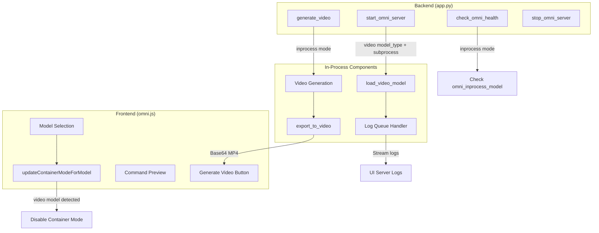

# Video In-Process Mode Implementation

## Overview

Implement in-process (offline inference) mode for all video models to bypass vLLM-Omni serving layer serialization bug, using model_type detection for future-proof flexibility.

## Todos

- [ ] Update existing audio detection from hardcoded "stable-audio" to model_type=="audio"
- [ ] Add model type validation in generate_audio to prevent video model misuse
- [ ] Add model_type=="video" detection in start_omni_server with in-process loading
- [ ] Implement load_video_model with vae_use_slicing, vae_use_tiling, flow_shift, enable_cpu_offload params
- [ ] Reuse QueueHandler pattern to stream video model loading logs to UI
- [ ] Add in-process branch in generate_video with OmniDiffusionSamplingParams and export_to_video
- [ ] Extend updateContainerModeForModel to detect video model_type
- [ ] Add video in-process command preview in updateCommandPreview
- [ ] Verify existing modes (subprocess, container, audio in-process) still work

## Problem Statement

The vLLM-Omni serving layer has a serialization bug that causes `AttributeError: 'numpy.ndarray' object has no attribute 'save'` for video generation. This is the same class of bug affecting Stable Audio. The workaround is to use offline (in-process) inference directly.

**Detection Strategy:** Use `model_type` (from config/recipe) instead of hardcoded model names. This ensures:

- All video models automatically use in-process mode
- Future models work without code changes
- Consistent with existing audio detection logic

## Architecture Overview



## Design Decision: One Model at a Time

The `omni_inprocess_model` global variable holds **one model at a time** (either audio OR video, not both). This matches the existing behavior of subprocess/container modes:

- User selects a model and starts the server
- To switch models, user must stop the current server first
- The safety checks in `generate_audio` and `generate_video` ensure the loaded model type matches the endpoint being called

This approach:

- Conserves GPU memory (only one model loaded)
- Maintains consistency with existing server lifecycle
- Prevents confusion about which model is active

## Implementation Details

### 1. Backend: Model Loading (app.py)

**Location:** `start_omni_server` function (after line 5153)

Add video model detection using `model_type` (generic, works for any video model):

```python
# Detect video models by model_type (applies to all video models due to serving bug)
if config.model_type == "video" and config.run_mode == "subprocess":
    logger.info("Detected video model - using in-process mode (bypasses serving bug)")
    omni_run_mode = "inprocess"

    def load_video_model():
        from vllm_omni.entrypoints.omni import Omni
        return Omni(
            model=config.model,
            vae_use_slicing=True,
            vae_use_tiling=True,
            flow_shift=5.0,
            enable_cpu_offload=True,
            enforce_eager=config.enforce_eager,
        )
```

**Note:** Using `model_type == "video"` instead of hardcoded model names ensures all current and future video models automatically use in-process mode until the vLLM-Omni serialization bug is fixed.

**Consistency:** Also update existing Stable Audio detection from `"stable-audio" in config.model.lower()` to `config.model_type == "audio"` for consistency.

**Log streaming:** Reuse the same `QueueHandler` pattern from Stable Audio to capture and broadcast `vllm`/`vllm_omni` logs during model loading.

### 2. Backend: Video Generation (app.py)

**Location:** `generate_video` function (line 5497)

Add in-process branch at the start:

```python
if omni_run_mode == "inprocess" and omni_inprocess_model is not None:
    # Safety: Verify this is a video model
    if omni_config.model_type != "video":
        return VideoGenerationResponse(success=False, error="In-process model is not a video model")

    # Build sampling params
    sampling_params = OmniDiffusionSamplingParams(
        guidance_scale=request.guidance_scale,
        num_inference_steps=request.num_inference_steps,
        height=request.height,
        width=request.width,
        num_frames=request.duration * request.fps,
    )

    # Generate
    outputs = omni_inprocess_model.generate(
        {"prompt": request.prompt, "negative_prompt": request.negative_prompt},
        sampling_params
    )

    # Extract frames and export to MP4
    frames = outputs[0].images  # List of PIL Images
    from diffusers.utils import export_to_video
    video_bytes = export_to_video(frames, fps=request.fps)

    # Return base64 encoded MP4
    return VideoGenerationResponse(success=True, video_base64=base64.b64encode(video_bytes).decode())
```

### 3. Backend: Safety Check for Audio Generation (app.py)

**Location:** `generate_audio` function (after line 5727)

Add model type validation:

```python
if omni_run_mode == "inprocess" and omni_inprocess_model is not None:
    # Safety: Verify this is an audio model
    if omni_config.model_type != "audio":
        return AudioGenerationResponse(success=False, error="In-process model is not an audio model")
```

### 4. Frontend: Container Mode Check (omni.js)

**Location:** `updateContainerModeForModel` function (line 1787)

Extend to detect video models using `model_type` from the selected recipe:

```javascript
updateContainerModeForModel(modelId) {
    // Get model_type from selected recipe
    const selectedRecipe = this.modelRecipes?.find(r => r.model === modelId);
    const modelType = selectedRecipe?.model_type;

    const isStableAudio = modelType === 'audio';
    const isVideoModel = modelType === 'video';

    if (isStableAudio || isVideoModel) {
        // Disable container mode, switch to subprocess
        // (existing logic)
    }
}
```

**Note:** Using `model_type` from the recipe ensures this works for any audio/video model without hardcoding model names.

### 5. Frontend: Command Preview (omni.js)

**Location:** `updateCommandPreview` function (line 2200+)

Add video in-process preview using `model_type`:

```javascript
// Get model_type from config or selected recipe
const modelType = config.model_type || this.getModelType(config.model);

if (modelType === 'video') {
    // Show Python offline inference code for video models
    commandPreview = `from vllm_omni.entrypoints.omni import Omni

omni = Omni(
    model="${config.model}",
    vae_use_slicing=True,
    vae_use_tiling=True,
    flow_shift=5.0,
    enable_cpu_offload=True,
    enforce_eager=${config.enforce_eager || false},
)

# Video generation (post-load)
outputs = omni.generate({"prompt": prompt, "negative_prompt": negative_prompt}, sampling_params)`;
}
```

## Existing Logic Preserved

| Component                      | Status                                  |
| ------------------------------ | --------------------------------------- |
| Subprocess mode (other models) | Unchanged - falls through existing code |
| Container mode                 | Unchanged - existing logic preserved    |
| Image generation               | Unchanged - uses API mode               |
| TTS generation                 | Unchanged - uses API mode               |
| Stable Audio in-process        | Unchanged - existing implementation     |
| Health check                   | Already handles `inprocess` mode        |
| Stop server                    | Already handles in-process cleanup      |

## UI Parameters (Existing)

The video generation UI already has these parameters configured in `vllm-omni.html`:

- Prompt / Negative prompt
- Resolution (width x height)
- Duration (seconds)
- FPS
- Guidance scale
- Inference steps
- Seed

No UI changes needed for parameters.
